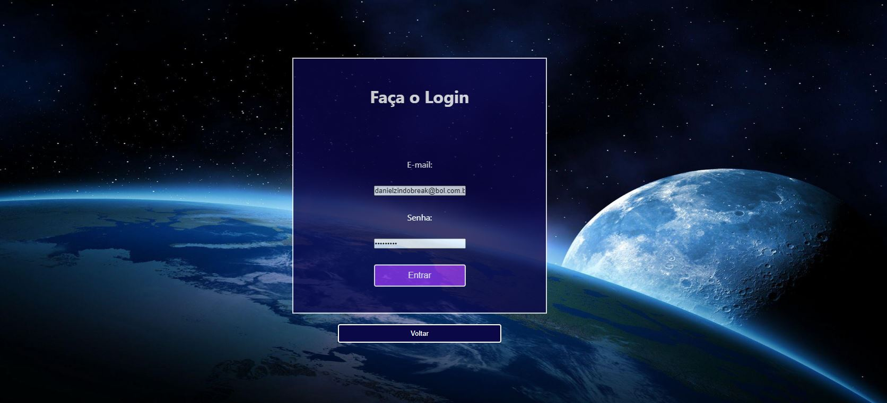
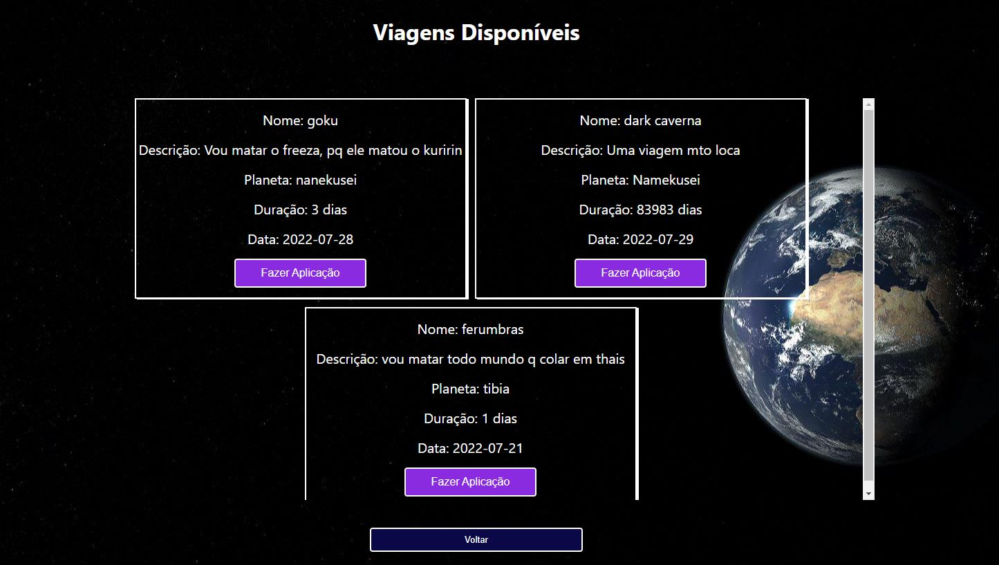

<h1> Readme </h1>

## Projeto LabeX

# Link 
Para vizualizar o projeto é possível acesá-lo através do link a seguir:

<a href="https://meaty-north.surge.sh/" target="_blank">Link Surge</a>

Para visitar a parte que o usuário deve estar logado, utilizar o login e senha abaixo:

Email: danielzindobreak@bol.com.br
Senha: 123581321

# Sobre

O LabeX é um site de viagens espaciais, onde o usuário pode se aplicar para essas viagens.

# Tecnologias

As seguintes ferramentas foram usadas na construção do projeto:

- [React](https://pt-br.reactjs.org/)
- JavaScript
- CSS
- Git
- Styled-Component
- Api-Rest

# Features

- [x] Página de Login
- [x] Página onde é possível visualizar as viagens
- [x] Formulário de aplicação para viagem selecionada
- [x] Página com detalhes da viagem
- [x] Formulário de criação de viagem

# Pré-requisitos

Antes de começar, você vai precisar ter instalado em sua máquina as seguintesferramentas: [Git](https://git-scm.com/), [Node.js](https://nodejs.org/en/).
Além disto é bom ter um editor para trabalhar com o código com [VSCode](https://code.visualstudio.com/download).

# Autor

- Daniel Andrade
 
[LinkedIn](https://www.linkedin.com/in/daniel-andrade-b91246177/)
 
[GitHub](https://github.com/DanielAndrade7)

